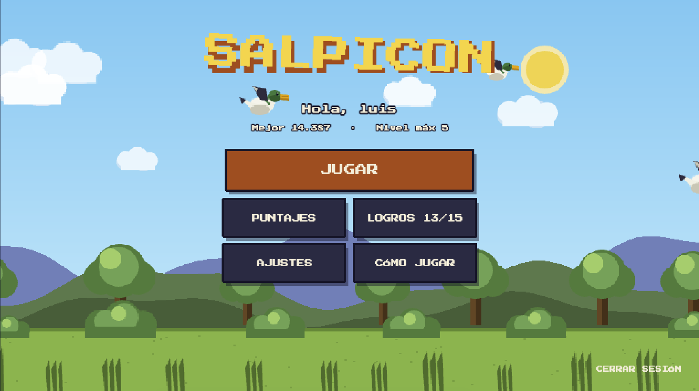
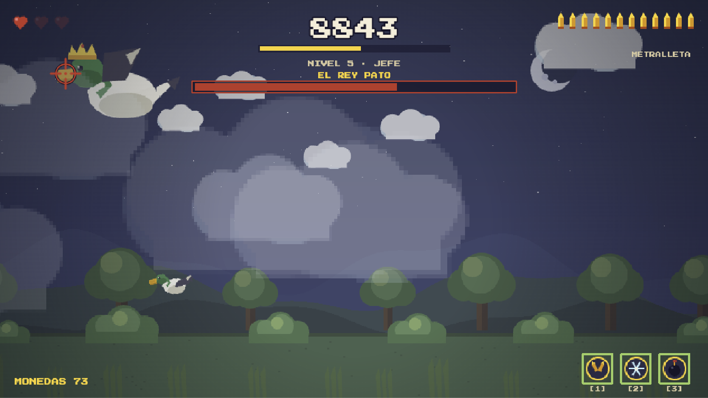
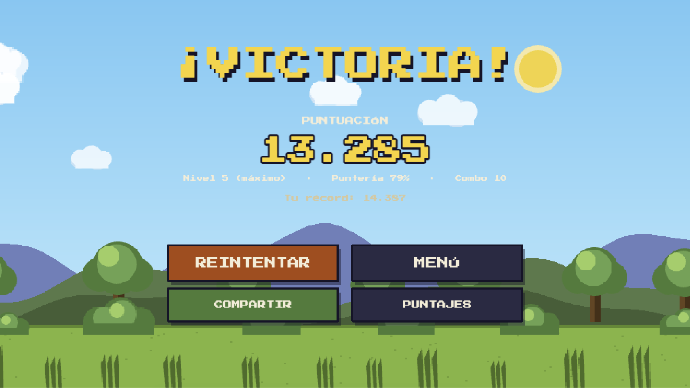

# Salpicón — Web Arcade Game

Videojuego web de tiro en la marisma desarrollado en 2D con estética pixel art. El proyecto implementa una arquitectura orientada a objetos basada en escenas, generación procedural de gráficos mediante código HTML5 Canvas, síntesis de audio en tiempo real con Web Audio API y físicas de precisión arcade.

---

## Capturas de Pantalla

<p align="center">
  
  
  
</p>

---

## Arquitectura y Stack Tecnológico

El proyecto está diseñado bajo una arquitectura limpia y desacoplada sin dependencia de assets externos alojados en disco. Todo el apartado visual y auditivo se genera en tiempo de ejecución.

| Componente | Tecnología | Responsabilidad Técnica |
|---|---|---|
| **Motor de Juego** | Phaser 3 | Manejo del game loop, máquina de estados de escenas, renderizador 2D, física de proyectiles, colisiones y cámara. |
| **Lenguaje** | TypeScript | Tipado estático riguroso, interfaces para la capa de datos, herencia de clases de entidades y detección de errores en compilación. |
| **Empaquetador** | Vite | Servidor de desarrollo con HMR y empaquetado optimizado con tree-shaking para producción. |
| **Generación de Arte** | HTML5 Canvas API | Dibujo procedural de sprites pixel-art, paleta de colores indexada y registro de texturas en el gestor de Phaser durante el arranque. |
| **Sistema de Audio** | Web Audio API | Sintetizador de efectos de sonido FX y composición musical adaptativa por capas en código puro. |

---

## Características de la Arquitectura

### 1. Generación Procedural de Assets (Zero-Asset Architecture)
Tanto las texturas visuales como los efectos de sonido se generan de manera dinámica al iniciar la aplicación:
- **Texturas**: Las rutinas ubicadas en la capa de arte procesan matrices numéricas para pintar frames de animación directamente en lienzos Canvas en memoria.
- **Audio**: Un bus centralizado sintetiza frecuencias, ondas cuadradas y ruido blanco para simular disparos, cuac de aves, explosiones y música adaptativa según la intensidad del juego.

### 2. Máquina de Estados y Flujo de Escenas
El juego administra el ciclo de vida de la interfaz mediante escenas independientes:
- `BootScene`: Carga inicial e inicialización procedural de texturas y sonidos.
- `AuthScene`: Gestión de credenciales locales y perfil de jugador.
- `MenuScene`: Navegación principal, configuración de parámetros y consulta de puntuaciones.
- `GameScene`: Ciclo principal de juego con gestión de oleadas, clima y patrones de movimiento.
- `HudScene`: Capa superpuesta en tiempo real para barras de estado, munición, combo y notificaciones.
- `GameOverScene`: Resumen de métricas, evaluación de rendimiento y exportación gráfica de resultados.

### 3. Sistema de Entidades y Patrones de Movimiento
- **Entidad Pato**: Implementación de inteligencia de vuelo errático con variaciones de velocidad, resistencia a disparos, temporizadores de escape y eventos al ser neutralizado.
- **Entidad Cocodrilo**: Agente dinámico encargado de la recolección en agua según el resultado del disparo.
- **Jefe Final**: Entidad compleja con barra de salud integrada, cambio de fase de ataque y spawn de unidades secundarias.

### 4. Eventos Climáticos y Física de Entorno
Cálculo de vectores de fuerza que afectan las trayectorias según las condiciones atmosféricas del nivel:
- **Viento**: Desplazamiento lateral progresivo de los proyectiles y entidades.
- **Lluvia y Niebla**: Renderizado de partículas y capas de oclusión visual.

---

## Controles del Juego

- **Mouse / Touch**: Control de retícula y disparo.
- **Tecla R**: Recarga manual del cargador.
- **Teclas P / ESC**: Pausa del sistema.
- **Tecla M**: Retorno al menú principal en estado de pausa.
- **Teclas 1, 2, 3**: Activación de habilidades de apoyo (Multiplicador, Congelación, Bomba de área).

---

## Estructura del Código Fuente

```text
src/
├── main.ts              Punto de entrada e inicialización de la configuración de Phaser
├── constants.ts         Definición de constantes globales, dimensiones y claves de eventos
├── art/                 Algoritmos de generación gráfica y definición de paleta de color
├── audio/               Controlador sintetizado de sonido y música adaptativa
├── data/                Estructura de datos para niveles, armas, logros y almacenamiento
├── objects/             Clases de entidades: Pato, Jefe Final y Cocodrilo
├── ui/                  Componentes de interfaz, fondos parallax y efectos de clima
└── scenes/              Conjunto de escenas que controlan el flujo de la aplicación
```

---

## Instalación y Despliegue

### Requisitos Previos
- Node.js versión 18.0 o superior
- Gestor de paquetes npm

### Pasos de Instalación

1. Clonar el repositorio:
   ```bash
   git clone https://github.com/luiscadn/DuckHuntFX.git
   cd DuckHuntFX
   ```

2. Instalar las dependencias del proyecto:
   ```bash
   npm install
   ```

3. Ejecutar en entorno de desarrollo local:
   ```bash
   npm run dev
   ```

4. Compilar para producción:
   ```bash
   npm run build
   ```

---

## Licencia

Este proyecto está bajo la Licencia MIT. Consulta el archivo [LICENSE](LICENSE) para más detalles.
