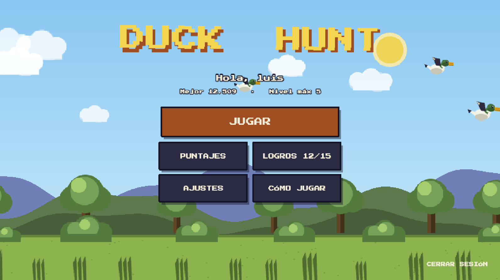
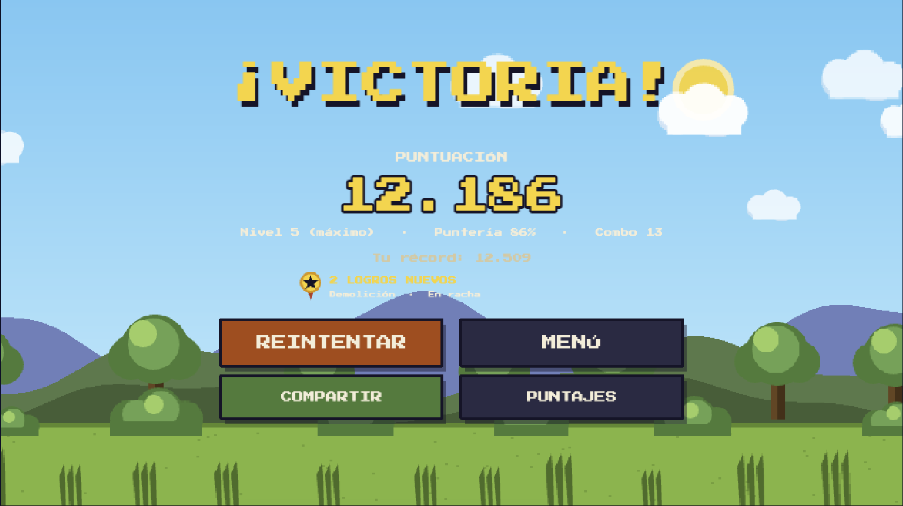

# Duck Hunt Web Arcade

Recreación moderna del clásico **Duck Hunt** desarrollada como videojuego web 2D de estilo arcade retro. El juego integra mecánicas dinámicas de disparo, gestión de combos por tiempo, progresión de armas, eventos climáticos interactivos, combates contra jefes, sistema de autenticación local y generación de reportes de victoria.

---

## Capturas del Juego

<p align="center">
  
  
</p>

---

## Tecnologías y Herramientas

| Tecnología | Rol en el Proyecto |
|---|---|
| **Phaser 3** | Motor de renderizado 2D, gestión de escenas, animación por sprites, física arcade, eventos de cámara e input de puntero |
| **TypeScript** | Arquitectura orientada a objetos con tipado estático estricto |
| **Vite** | Entorno de desarrollo ultrarrápido y pipeline de empaquetado para producción |
| **Web Audio API** | Síntesis procedural de efectos de sonido y pistas musicales dinámicas |
| **HTML5 Canvas API** | Generación programática de texturas y exportación de tarjetas de puntuación |

---

## Características Principales

### Mecánicas de Juego y Controles
- **Puntería con Mouse o Touch**: Disparo de precisión con retroceso visual y calibración de retícula.
- **Gestión de Munición**: Cargador asignado por objetivo. Si se agotan los tiros y el objetivo escapa, se descuenta una vida.
- **Atajos de Teclado**:
  - `R`: Recargar munición.
  - `P` / `ESC`: Pausar partida.
  - `M` (en pausa): Regresar al menú principal.
  - `1`, `2`, `3`: Despliegue de habilidades especiales desbloqueadas por nivel.

### Habilidades Especiales
- **Doble Puntuación**: Multiplica la puntuación obtenida durante un periodo temporal.
- **Congelación**: Ralentiza drásticamente el desplazamiento de los objetivos.
- **Bomba de Área**: Neutraliza instantáneamente todos los objetivos visibles en pantalla.

### Variedad de Objetivos
| Tipo | Comportamiento y Características |
|---|---|
| **Estándar** | Comportamiento base y trayectoria clásica |
| **Rápido** | Menor tamaño, trayectoria errática y bonificación de puntos |
| **Blindado** | Requiere múltiples impactos directos para ser neutralizado |
| **Dorado** | Objetivo infrecuente con multiplicador alto de puntos y activación de cámara lenta |
| **Bomba** | Provoca detonación en cadena; si escapa, penaliza con 2 vidas |

### Sistema de Combos y Logros
- **Multiplicador Progresivo**: Impactos consecutivos incrementan el multiplicador hasta x4 con una barra de tiempo dinámica.
- **15 Logros Desbloqueables**: Persistidos en almacenamiento local con notificaciones contextuales en tiempo real.

### Progresión, Tienda y Jefe Final
- **Arsenal Desbloqueable**: Pistola estándar, escopeta con dispersión en abanico, rifle de alto impacto y ametralladora de disparo rápido.
- **Tienda entre Niveles**: Intercambio de monedas obtenidas por mejoras de cargador, vidas adicionales, velocidad de recarga y nuevas armas.
- **Enfrentamiento de Jefe**: Combate final contra "El Rey Pato", con barra de salud, patrones de embestida y convocación de oleadas secundarias.
- **Ambientación y Clima Dinámico**: Condiciones de viento que alteran trayectorias, lluvia, tormentas eléctricas y niebla volumétrica.

### Compartir Resultados
- Generación y exportación de tarjeta gráfica personalizada en formato PNG con métricas de precisión, combo máximo y puntaje final lista para compartir.

---

## Estructura del Código

```text
src/
├── main.ts              Punto de entrada, configuración de Phaser y registro de escenas
├── constants.ts         Constantes de escala, reglas de juego y dimensiones del canvas
├── art/                 Paleta de color y generación procedural de texturas pixel art
├── audio/               Controlador de audio sintetizado y temas musicales adaptativos
├── data/                Definiciones de niveles, armas, catálogo de logros y persistencia
├── objects/             Entidades de juego: Patos, Jefe Final y Perro
├── ui/                  Capas de parallax, efectos de clima, botones y estilos de interfaz
└── scenes/              Flujo de escenas: Carga, Autenticación, Menú, Ajustes, Juego y Fin de Partida
```

---

## Instalación y Ejecución Local

### Prerrequisitos
- Node.js 18 o superior
- npm o gestor de paquetes equivalente

### Pasos

1. Clonar el repositorio:
   ```bash
   git clone https://github.com/luiscadn/DuckHuntFX.git
   cd DuckHuntFX
   ```

2. Instalar dependencias:
   ```bash
   npm install
   ```

3. Iniciar el servidor de desarrollo:
   ```bash
   npm run dev
   ```

4. Generar el paquete optimizado para producción:
   ```bash
   npm run build
   ```

---

## Autores y Licencia

Desarrollado como proyecto de portafolio por **Luis Cadena**.

Distribuido bajo los términos de la Licencia MIT. Consulta el archivo [LICENSE](LICENSE) para más información.
